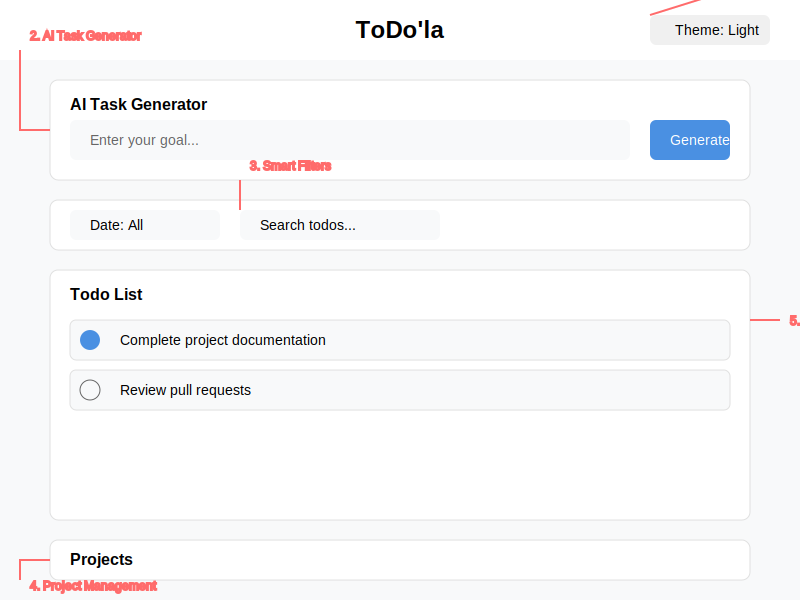

# ToDo'la - Modern Todo List App

A modern, feature-rich todo list application built with React and Vite, featuring AI-powered task generation and a beautiful, customizable interface.

## 📱 App Preview



### Key Features Highlighted:

1. **Theme Selector** - Quick theme switching in the top-right
2. **AI Task Generator** - Generate tasks from goals using OpenAI
3. **Smart Filters** - Combined date filter and search functionality
4. **Project Management** - Organize tasks into projects
5. **Todo List** - Create, edit, and manage your tasks
6. **Banner System** - Status notifications and alerts

## ✨ Features

### Task Management
- Create, edit, and delete todos with ease
- Mark tasks as complete/incomplete
- Real-time search functionality across todos and projects
- Smart date handling (Today, Someday, or custom dates)
- Rich text formatting for task descriptions

### Project Organization
- Create and manage multiple projects
- Organize todos by project
- Quick project switching
- Project-specific task views
- Delete projects with associated tasks

### AI Task Generator
- Generate task lists from goals using OpenAI
- Smart task breakdown
- Intelligent task suggestions
- Automatic task creation from AI suggestions

### Smart Filtering & Search
- Filter tasks by date
- Real-time search across todos and projects
- Combined search and date filtering
- Quick access to today's tasks
- View tasks scheduled for "Someday"

### UI/UX Features
- Clean, modern interface
- Responsive design for all devices
- Smooth animations and transitions
- Intuitive drag-and-drop interface
- Limited viewport with custom scrolling

### Theming System
- 6 beautiful pre-built themes:
  - Spring Breeze (Light)
  - Sunset Gold (Light)
  - Lavender Mist (Light)
  - Midnight Ocean (Dark)
  - Dark Forest (Dark)
  - Dark Amethyst (Dark)
- Real-time theme switching
- Persistent theme preference

### Data Management
- Automatic data persistence
- MongoDB database integration
- RESTful API architecture
- Efficient state management
- Data validation and error handling

### Notification System
- Success/error notifications
- Task completion alerts
- Project update notifications
- AI generation status updates
- Dismissible banner system

## 🛠 Tech Stack

### Frontend
- React 18
- Vite
- FontAwesome Icons
- CSS Variables for theming
- Custom hooks for state management

### Backend
- Express.js
- MongoDB
- OpenAI API integration
- RESTful API design

## 🚀 Getting Started

1. Clone the repository:
   ```bash
   git clone https://github.com/yourusername/todo-list-app.git
   cd todo-list-app
   ```

2. Install dependencies:
   ```bash
   npm install
   ```

3. Set up environment variables:
   ```bash
   cp .env.example .env
   # Add your OpenAI API key and MongoDB URI
   ```

4. Start the development server:
   ```bash
   npm run dev
   ```

5. Open [http://localhost:5173](http://localhost:5173) in your browser.

## 📜 Available Scripts

- `npm run dev` - Start development server
- `npm run build` - Build for production
- `npm run preview` - Preview production build
- `npm run server` - Start backend server

## 🎨 Theme Customization

Each theme includes carefully crafted variables for:
- Primary and accent colors
- Text colors
- Background surfaces
- Border styles
- Shadow effects
- Gradient effects
- State colors (success, error, etc.)

## 📁 Project Structure

```
todo-list-app/
├── src/
│   ├── components/    # React components
│   ├── services/      # API and task generation
│   ├── hooks/         # Custom React hooks
│   ├── styles/        # CSS and theme files
│   └── utils/         # Helper functions
├── server/
│   ├── models/        # MongoDB models
│   ├── routes/        # API routes
│   └── middleware/    # Express middleware
└── public/            # Static assets
```

## 🔒 Security

- Environment variables for sensitive data
- API key validation
- Request rate limiting
- Input sanitization
- Error boundary implementation

---

Built with ❤️ using Cascade AI
